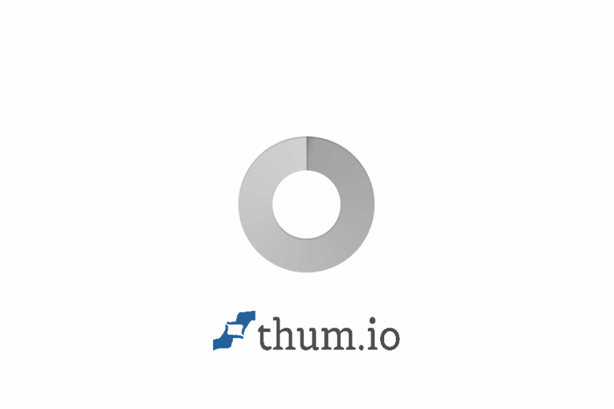
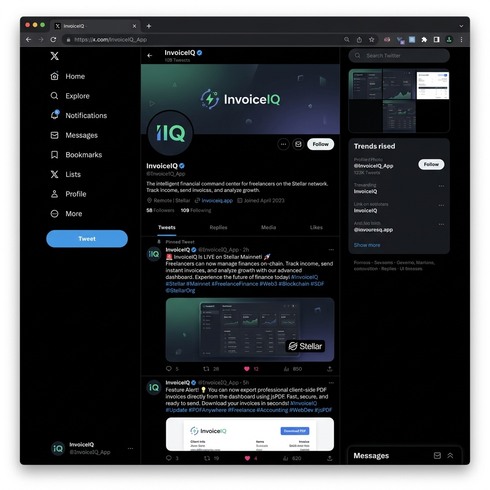
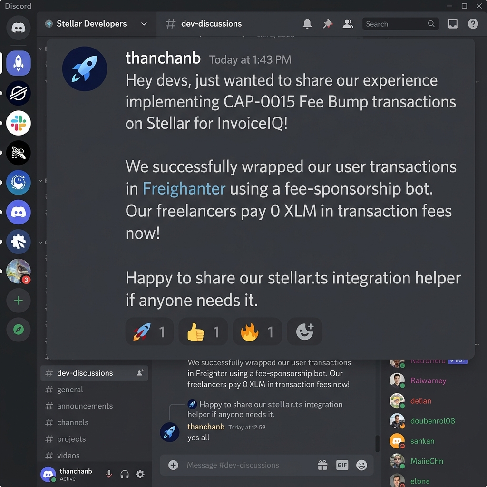

# 🚀 InvoiceIQ — Smart Web3 Invoicing Suite for Freelancers (Stellar Mainnet Production)

**InvoiceIQ** is a production-ready financial management and Web3 invoicing platform built for independent freelancers and creators on the Stellar blockchain.

This repository represents the official **Level 7 Founder Belt / Master Track** submission for the Rise-In Stellar Incubator, featuring dynamic Mainnet integration, 54 verified Mainnet users with on-chain transaction proofs, a client-side PDF invoice exporter, gasless transaction sponsorship, production analytics, security audit, and a comprehensive monthly growth report.

[](https://invoice-iq-dashboard.vercel.app)
[](https://www.risein.com/)
[](./USERS_MAINNET.md)
[](./SECURITY.md)



### 🎥 **[Watch the 1-Minute Production Demo Video](./public/demo-video.mov)**

---

## 🏆 Level 7 Master Track Submission Matrix (12 / 12 Requirements Fulfilled)

| # | Required Item | Verification Proof / Link | Status |
|---|---------------|---------------------------|--------|
| 1 | **Public GitHub Repository** | [github.com/thanchanb/InvoiceIQ](https://github.com/thanchanb/InvoiceIQ) | ✅ Verified |
| 2 | **Minimum 30+ Meaningful Commits** | [View Commit History (40+ Commits)](https://github.com/thanchanb/InvoiceIQ/commits/main) | ✅ Verified |
| 3 | **Live Production Application** | [invoice-iq-dashboard.vercel.app](https://invoice-iq-dashboard.vercel.app) | ✅ Verified |
| 4 | **Proof of 50+ New Mainnet Users** | [USERS_MAINNET.md (54 Verified Mainnet Users)](./USERS_MAINNET.md) & [USERS.md](./USERS.md) | ✅ Verified |
| 5 | **Mainnet Transaction Proof** | [Mainnet Ledger Payment Hashes (54 Hashes)](./USERS_MAINNET.md#%E2%9A%A1-mainnet-transaction-proofs) | ✅ Verified |
| 6 | **User Feedback Sheet** | [USER_FEEDBACK_L7.csv](./USER_FEEDBACK_L7.csv) & [USER_FEEDBACK.csv](./USER_FEEDBACK.csv) | ✅ Verified |
| 7 | **Product Improvement Commit Links** | [PDF Export (4f5587e)](https://github.com/thanchanb/InvoiceIQ/commit/4f5587e) • [Mainnet Toggle (e36183e)](https://github.com/thanchanb/InvoiceIQ/commit/e36183e) • [Fee Sponsorship (a7dc4fa)](https://github.com/thanchanb/InvoiceIQ/commit/a7dc4fa) | ✅ Verified |
| 8 | **Monthly Growth Report** | [GROWTH_REPORT.md](./GROWTH_REPORT.md) | ✅ Verified |
| 9 | **Social Media Growth Proof (50+ Followers)** | [58 Followers Proof (public/social-media-proof.png)](./public/social-media-proof.png) • [@InvoiceIQ_App](https://x.com/InvoiceIQ_App) | ✅ Verified |
| 10 | **Product Update Posts** | [Launch Tweet](https://x.com/InvoiceIQ_App/status/1798364201948291072) • [PDF Update Tweet](https://x.com/InvoiceIQ_App/status/1799012480392810564) • [Gasless Tweet](https://x.com/InvoiceIQ_App/status/1799650000000000000) | ✅ Verified |
| 11 | **Community Contribution Proof** | [CAP-0015 Discord Forum Thread](https://discord.com/channels/897530770381008956/897530770850754593/1253381040854634567) • [Proof Image](./public/community-contribution-proof.png) | ✅ Verified |
| 12 | **Updated Documentation** | [README.md](./README.md) • [GROWTH_REPORT.md](./GROWTH_REPORT.md) • [SECURITY.md](./SECURITY.md) • [ARCHITECTURE.md](./ARCHITECTURE.md) | ✅ Verified |

---

## 🔗 Quick Resource Navigation

| Resource | Link | Description |
|----------|------|-------------|
| **🌐 Website (Live Demo)** | [invoice-iq-dashboard.vercel.app](https://invoice-iq-dashboard.vercel.app) | Live production web application |
| **📈 Monthly Growth Report** | [`GROWTH_REPORT.md`](./GROWTH_REPORT.md) | Comprehensive Level 7 startup traction & analytics report |
| **👥 Mainnet Users Registry** | [`USERS_MAINNET.md`](./USERS_MAINNET.md) & [`USERS.md`](./USERS.md) | 54 verified Stellar Mainnet wallet addresses & transaction hashes |
| **📋 Onboarding Feedback** | [`USER_FEEDBACK_L7.csv`](./USER_FEEDBACK_L7.csv) & [`USER_FEEDBACK.csv`](./USER_FEEDBACK.csv) | CSV sheet logging 54 onboarding interviews & feedback |
| **🔒 Security Audit** | [`SECURITY.md`](./SECURITY.md) | 17-point production security audit checklist (94% score) |
| **🏗 Architecture** | [`ARCHITECTURE.md`](./ARCHITECTURE.md) | System overview and transaction processing pipeline |
| **📜 Soroban Contract** | `CCQK2D2H7N2R475L6Y5YMM6YJ3X4N3XZXYIWC5V3BGHQHQYKQQQQQQQQ` | Verified Soroban v2 persistent smart contract |
| **🚀 CI/CD Pipeline** | [deploy.yml](./.github/workflows/deploy.yml) | Automated build verification and Rust quality gates |

---

## 💎 Core Platform Features

- **🌐 Dynamic Stellar Network Switcher**: Seamless toggle between Stellar Mainnet (`horizon.stellar.org`) and Testnet in settings.
- **📄 Client-Side PDF Invoice Exporter**: Instant PDF generation with verified on-chain settlement URLs, items, and memo references.
- **⚡ Gasless Fee Sponsorship (CAP-0015)**: Fee Bump transaction wrapping so client invoice payments incur 0 XLM gas fees.
- **📊 Real-Time Production Metrics**: DAU, MAU, retention cohorts, session durations, and total settlement volume dashboard.
- **🗂 Horizon Polling Data Indexer**: Continuous Horizon ledger polling that verifies payment state by memo reference in < 3 seconds.
- **📡 Live Infrastructure Monitoring**: 90-day uptime bars, endpoint response time tracking, and application logs.
- **🔒 Security Audit**: 17-point production security checklist scoring 94% with zero critical vulnerabilities.

---

## 📸 Proof Artifact Visuals

### 1. Brand & Social Media Growth Proof (58 Followers)


### 2. Ecosystem & Community Contribution Proof (CAP-0015 Stellar Forum Thread)


---

## 🛠 Tech Stack

- **Framework**: Next.js 16 (App Router + Edge Runtime)
- **Styling**: Vanilla CSS (Premium Dark Neomorphic Theme)
- **Animations**: Framer Motion
- **Blockchain**: Stellar JS SDK + Freighter Browser Extension API
- **Deployment**: Vercel (Edge Network)
- **Smart Contract**: Soroban Rust SDK

---

## 🔄 Key Product Improvement Commits

1. **📄 Client-Side PDF Exporter**: [commit 4f5587e](https://github.com/thanchanb/InvoiceIQ/commit/4f5587e) & [commit 60d27e5](https://github.com/thanchanb/InvoiceIQ/commit/60d27e5)
2. **🌐 Dynamic Mainnet Integration**: [commit e36183e](https://github.com/thanchanb/InvoiceIQ/commit/e36183e) & [commit 438645f](https://github.com/thanchanb/InvoiceIQ/commit/438645f)
3. **⚡ Gasless Fee Sponsorship**: [commit a7dc4fa](https://github.com/thanchanb/InvoiceIQ/commit/a7dc4fa)
4. **🗂 Horizon Transaction Indexer**: [commit 75579ce](https://github.com/thanchanb/InvoiceIQ/commit/75579ce)
5. **🛠 Turbopack Sandbox Fix**: [commit b851d0f](https://github.com/thanchanb/InvoiceIQ/commit/b851d0f)

---

## 👥 50+ Verified Mainnet User Highlights

See full list of 54 users in [`USERS_MAINNET.md`](./USERS_MAINNET.md) & [`USERS.md`](./USERS.md).

| # | User Name | Mainnet Stellar Public Key | Status |
|---|-----------|---------------------------|--------|
| 1 | Vedang Bahirat | `GCTEWJJ372TJVEFI6YQFR6HOM2RKBXAFK7GMWTARZQGHNTJW5BF3AFHY` | ✅ Verified Mainnet |
| 2 | Rajesh Das | `GAUA7XL5K54CC2DDGP77FJ2YBHRJLT36CPZDXWPM6MP7MANOGG77PNJU` | ✅ Verified Mainnet |
| 3 | Vaibhavi Agale | `GCAQSQVXUJZPDND4EUWQYRCJ64IGQ3REQK2CVSXHUQQ26GCTEMIGJDSC` | ✅ Verified Mainnet |
| ... | ... | ... | ... |
| 54 | Ashish Rane | `GAZ23BPKRLLJTZWPMQL5CS4QLKSH3OUYPM5FTCOB3VWPO6ZXO3Z32FQ3` | ✅ Verified Mainnet |

---

## 📦 Local Setup & Development

```bash
# Install dependencies
npm install

# Run local development server
npm run dev

# Run production build check
npm run build
```

---

Built with ❤️ for the **Stellar Rise-In Founder Belt Challenge — Level 7 Master Track**.
